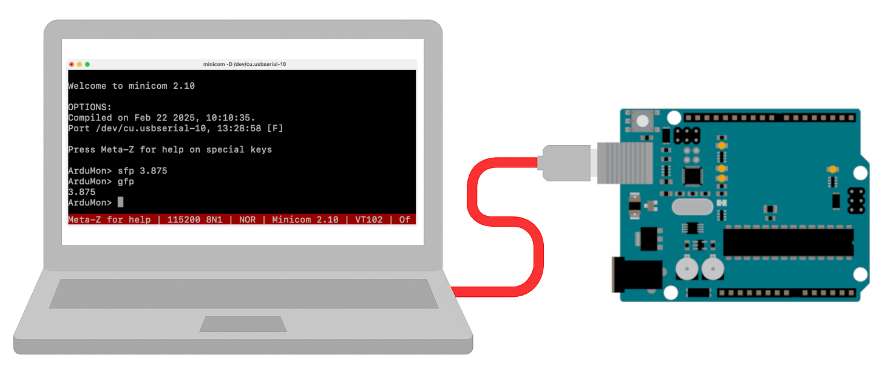

<div style="width: 50em"> 

# ArduMon

**add a CLI *and* a packet API to your Arduino project**


[](./photos/ArduMon.png)

**CURRENT STATUS: WORK IN PROGRESS**

Copyright 2025 Marsette A. Vona (martyvona@gmail.com)

[MIT License](./LICENSE.txt)

Once upon a time, it was not uncommon in microcontroller development to implement a *firmware monitor* as a command line interface (CLI) exposed on a serial port.  (The term *monitor* has been used both for firmware that exposes a user interface as well as for the serial terminal program which would [connect](#connecting-to-ardumon) to it.)  Though there are now more [advanced options](https://www.st.com/en/development-tools/stm32cubemonitor.html), serial monitors are still implemented, particularly on smaller platforms.  And there is [no](https://github.com/kcl93/VT100) [shortage](https://github.com/gpb01/SerialCmd) of [existing](https://github.com/ppedro74/Arduino-SerialCommands) [Arduino](https://github.com/argandas/SerialCommand) [libraries](https://github.com/naszly/Arduino-StaticSerialCommands) to help implement them.

*ArduMon* is yet another one of these, but with a few features that I didn't see in most of the existing ones:

* The same command handler code can operate in either text or binary mode.  Text mode would be used for a traditional CLI-style monitor user interface.  Binary mode reuses the same command implementations, but turns them into an efficient packet-based application programming interface (API).
* Supported command argument and response data types include: character, string, boolean, 8/16/32/64 bit signed and unsigned integers, and 32 and 64 bit floating point numbers.  Each command can accept zero or more parameters of these types and also respond with zero or more of them.  Text mode responses can also respond with free-form text, or with VT100 control sequences, e.g. to implement a dynamically updating text display.  In text mode, integers can be read and written in hexadecimal or decimal, and floating point numbers can be read and written in decimal or scientific format.
* ArduMon implements a basic command line user experience in text mode: echo is supported, an optional text prompt is displayed, the user may hit backspace to erase the most recent character, and hitting the up arrow re-enters the previous command (if there was enough memory to save it).

ArduMon also
* can be used to implement both the "server" and the "client" side of a binary communication link
* supports registering both function pointer and [functionoid](https://isocpp.org/wiki/faq/pointers-to-members#functionoids) command handlers
* allows handlers that return nothing, a single response, or an arbitrary amount of data over time
* makes it convenient to use VT100/ANSI control codes to create a UI with styled text and in-place updating
* is 8 bit AVR compatible
* supports AVR, ESP32, and STM32 Arduino compatible boards
* can optionally also be built for PC: OS X, Linux, [Windows Subsystem for Linux (WSL)](https://learn.microsoft.com/en-us/windows/wsl/install)
* can have a relatively low memory footprint (configurable)
* has a [fluent](https://en.wikipedia.org/wiki/Fluent_interface) API (i.e. method chaining)
* uses no heap allocations
* is implemented in a single header file
* allows multiple instances; e.g. a text CLI on `Serial0` for user interaction and a binary packet interface on `Serial1` to communicate with another Arduino.

In many cases the same command handler can work in both binary and text mode: call the ArduMon `recv(...)` APIs to read command parameters and the `send(...)` APIs to write results, and finally `end_handler()`.  It is also possible to make a handler behave differently in text and binary mode, e.g. by checking the `is_binary_mode()` and `is_text_mode()` ArduMon APIs.  For example, a handler could stream a text response with VT100 control codes to update a live display on the terminal, but in binary mode it could instead send a stream of binary packets.  The demo shows an example like this in the `AM_Timer` class.

ArduMon implements its own send and receive buffers, with sizes configurable at compile time, in addition to the serial send and recieve buffers built into the Arduino platform.

In text mode the entire received command string must fit in the ArduMon receive buffer.  There is no limit on the amount of data that can be returned by a command in text mode, though sending may block the handler if enough data is sent fast enough relative to the Arduino serial send buffer size, typically 64 bytes, and the serial baudrate.   The ArduMon send buffer is not used in text mode, and can be disabled at compile time if binary mode will not be used.

In binary mode both commands and responses are sent in variable length packets of up to 255 bytes.  The ArduMon receive and send buffers must be sized at compile time to fit the largest used packets; if an application is receive-only then the ArduMon receive buffer can be disabled.  The first byte of each packet gives the packet length in bytes (2-255), the second byte is typically a command code, and the last byte is a checksum.  The max payload size per packet is 253 bytes, as there are always two overhead bytes: length (first byte) and checksum (last byte).  The command code, if present, is considered part of the payload.  If a packet consisting of only two bytes (length and checksum) is received, or if the second byte is not a the code of a registered command handler, then the packet can only be handled by the universal or fallback handlers, see `set_universal_handler()` and `set_fallback_handler()`, both of which are optional.  Zero or more packets can be returned in series from a single command handler, see `send_packet()`.

The ArduMon `update()` API should be "pumped" from the Arduino `loop()` method.  Command handlers are run directly from `update()`, so if they run long, they will block `loop()`.  A handler may return before handling is complete, as long as `end_handler()` is eventually called.  ArduMon also has an optional receive timeout (`set_recv_timeout_ms()`) which will reset the command interpreter if too much time has passed between receiving the first and last bytes of a command.  This is disabled by default; it probably makes more sense for automation than for interactive use.

In text mode a single handler can return an arbitrary amount of data.  In binary mode a single handler can send an arbitrary number of response packets (see `send_packet()`).  In either case this would typically require breaking the handler up so that `loop()` is not blocked.

It is also acceptable to send data when a command handler is not actually running.  This can be used to use one instance of ArduMon to invoke commands on another instance.  Or, a command could trigger sending periodic status strings in text mode (or status packets in binary mode) indefinitely until another command is received to end the stream.  ArduMon can even be used for send-only applications, for example to broadcast a never ending stream of packets in binary mode.

Handlers can also implement their own sub-protocols, reading and optionally writing directly to the serial port (typically via the Arduino serial send and receive buffers).  Command receive is disabled while a handler is running, so during that time a handler can consume serial data that's not intended for the command processor.  For example, an interactive text mode handler that is updating a live display on the terminal could exit when a keypress is received from the user.

Most of the ArduMon APIs return a reference to the ArduMon object itself, which enables method chaining, also known as a [fluent interface](https://en.wikipedia.org/wiki/Fluent_interface).  An ArduMon instance can also be converted to `bool` to check if there is currently any error on it. 

## Error Handling

The ArduMon object maintains an error state; once it's set, it's sticky until `clear_err()` is called.  You can also register an error handler that will be automatically called during `end_handler()`; the demo shows an example of using this to report errors.  The `send(...)` and `recv(...)` APIs will be no-ops if ArduMon is already in an error state.  The `recv(...)` APIs can generate `RECV_UNDERFLOW` in both text and binary mode and `BAD_ARG` in text mode. The `send(...)` APIs can generate `SEND_OVERFLOW` in binary mode, but in text mode they block as necessary and cannot error.  Command reception (or any received packet in binary mode) can generate `RECV_OVERFLOW`, `RECV_TIMEOUT`, or `BAD_CMD`; as well as `BAD_PACKET` in binary mode or `PARSE_ERR` in text mode.  The `UNSUPPORTED` error can only be generated due to a programming inconsistency, e.g. calling `set_binary_mode(true)` when ArduMon was configured `with_binary = false`, or `recv(int64_t)` when configured `with_int64 = false`.

In binary mode ArduMon uses an 8 bit checksum for basic (but fallible) communication error detection.  There is no built in correction of communication errors, e.g. an ACK/NACK protocol, retries, etc.  The demo shows an example of invoking a command to set a parameter and then verifying that the parameter was set as intended by invoking another command to read back the parameter value.  This is not very efficient and is still susceptible to several types of failure.  ArduMon is intended to be simple and to support both text and binary communication for rapid development.  For high reliability binary communication consider switching to [CAN bus](https://en.wikipedia.org/wiki/CAN_bus), which has built-in error detection and correction.

## Flow Control

Flow control is also up to the application.  In interactive use the operator can wait as appropriate and/or verify a response before sending another command.  The included `ardumon_client` native program can send commands from a script file (or stream from another application).  While it is also possible to `cat` such commands directly to the serial port, the `ardumon_client` approach enables flow control by waiting for responses for each command.

Binary mode clients can similarly implment flow control either by waiting a sufficient time between sending each command or by waiting for a response.

Only one command is handled at a time.  If a new command starts coming in while one is still being handled then the new command will start to fill the Arduino serial input buffer, which is typically 64 bytes.  Once the Arduino serial input buffer fills, further received bytes will be silently dropped; the Arduino serial receive interrupt unfortunately [does not signal overflow](https://arduino.stackexchange.com/a/14035).

Operating systems also traditionally offer both [hardware](https://en.wikipedia.org/wiki/RTS/CTS) (RTS/CTS) and [software](https://en.wikipedia.org/wiki/Software_flow_control) (XON/XOFF) flow control for serial ports.  In most modern situations these should be disabled by default, but it is best to ensure this is the case when using ArduMon to communicate with a PC.  Otherwise communication could be inadvertently interrupted, particularly in binary mode with software flow control, where transmission from the PC would be halted whenever the XOFF character (ASCII 19) is received, meaning the communication channel is not [8-bit clean](https://en.wikipedia.org/wiki/8-bit_clean).  The [native demo](./demo/native/demo.cpp) shows one way to ensure serial port flow control is disabled using the `cfmakeraw()` and `tcsetattr()` UNIX APIs; another method is to use the `stty` command.

## Text Mode

For each command in text mode:

1.  An optional prompt is sent, preceded by carriage return and line feed, and suffixed with a space.
1.  Characters are read, with optional echo, until a carriage return (`\r`, `0x0D`) or line feed (`\n`, `0x0A`) is
    received. In echo mode both a carriage return and line feed are sent when the end of command is received.  Both
    Unix/OS X style `\r` line endings as well as Windows style `\r\n` are supported, though the latter will incur an
    ignored empty command and an extra `\r\n` response if echo is enabled.  Terminal programs like minicom typically
    send only `\r` when the user hits the `return` key, so the other line ending types are more likely to be encountered
    when receiving a file of commands, in which case echo would typically be disabled, and ignored empty commands should    not matter.
1.  If the backspace character (`\b`, `0x08`) is received and there was a previously received character in the command
    then (a) the previously received character is ignored and (b) VT100 control codes are sent to erase the previous
    character on the terminal if echo is enabled.
1.  If the received command is empty then it is ignored and the command interpreter resets.
1.  If the received command including the terminating carriage return is larger than the receive buffer then
    `RECV_OVERFLOW` and the command interpreter resets.
1.  The received command is tokenized on whitespace.  End-of-line comments starting with `#` are ignored.  Character
    tokens can be unquoted or surrounded by single quotes.  In the quoted form the backslash escape sequences below
    are supported.  The quoted form also allows `'#'` where the `#` will not be interpreted as the start of a comment.
    String tokens must be surrounded by double quotes unless they contain no whitespace, quotes, or `#`, in which case
    the quotes are optional.
1.  If the first token of the command is not in the command table then `BAD_CMD` and the command interpreter resets.
    An optional universal command handler can be registered which handles all commands without inspecting the first
    command token, and an optional fallback command handler can also be registered to handle commands with unknown
    command tokens.
1.  Otherwise, the command handler is executed.  It may call the `recv(...)` APIs to parse the command tokens in order.
    Call `recv()` with no arguments to skip a token, including the command token itself.  If there are no more tokens
    then `RECV_UNDERFLOW`.  If the next token is not in the expected form then `BAD_ARG`.
1.  The command handler may also call the `send(...)` APIs at any point to stream results back to the serial port.  In
    text mode returned data is sent incrementally.  There is no limit to the amount of data that can be sent in
    response to a command, but the `send(...)` APIs will block if the send buffer is full. Each sent value after the
    first will be prefixed by a space, unless the handler calls `send_CRLF()` which will replace the space with a
    `\r\n` sequence that will set the cursor to the start of the next line.  Sent characters will be single quoted and
    backslash escaped if they contain a quote or whitespace character. Sent strings will be double quoted and backslash
    escaped if they contain a quote or whitespace character.  The `send_raw()` APIs can be used to avoid the space
    prefix, quote, and escape behaviors.
1.  The command handler must end with a call to `end_handler()`, which will reset the command interpreter.

Supported backslash escape sequences in text mode:

* `\'` `0x27` single quote
* `\"` `0x22` double quote
* `\\` `0x5c` backslash
* `\a` `0x07` bell
* `\b` `0x08` backspace
* `\f` `0x0c` form feed
* `\n` `0x0a` line feed
* `\r` `0x0d` carriage return
* `\t` `0x09` horizontal tab
* `\v` `0x0b` vertical tab
* `\e` `0x1b` escape (nonstandard)
* `\d` `0x7f` delete (nonstandard)

Integers are parsed and formatted in decimal or hexadecimal in text mode, and floating point numbers are parsed and formatted with optional scientific notation by default.

## Binary Mode

Each command in binary mode is a packet consisting of

1.  A packet length `L` as a single unsigned byte.  The packet length includes the length byte itself, the command code
    byte, and the checksum byte.  If `L < 2` then `BAD_COMMAND` and the command interpreter resets.
2.  An optional command code as a single unsigned byte (if present, this is the first byte of the payload).
3.  Additional payload bytes.
4.  A single byte checksum such that the 8 bit unsigned sum of the bytes of the entire packet from the length byte
    through the checksum byte itself is 0.

In binary mode a command handler is called when the full length of a packet with a valid checksum (otherwise `BAD_PACKET`) and known command code (otherwise `BAD_CMD`) is received.  An optional universal command handler can be registered which handles all packets without inspecting the command code byte; this is the way to handle packets which don't have an explicit command code.  An optional fallback command handler can also be registered to handle packets with unknown command codes.

The command handler may call the `recv(...)` APIs to access the received data bytes in order.  The first byte returned will be the command code itself; call `recv()` with no arguments to skip a byte.  Attempts to `recv(...)` beyond the end of the payload will result in `RECV_UNDERFLOW`.  The command handler may also call the `send(...)` APIs at any point to append data to the send buffer.  Sending more than `min(send_buf_sz - 2, 253)` bytes results in `SEND_OVERFLOW`.  When `send_packet()` or `end_handler()` is called the send buffer is enabled for transfer to the serial port.  As much of it as possible is sent immediately, blocking up to `send_wait_ms` (0 by default).  Any remaining bytes will be drained in later calls to `update()`. The sent data will be prefixed with an unsigned length byte which includes itself, and suffixed with a checksum byte, which is also included in the length.  The checksum will be computed such that the 8 bit unsigned sum of the bytes of the entire packet from the first (length) byte through the checksum byte itelf is 0.

Multibyte quantities are read and written in little endian byte order in binary mode, which matches the endianness of the architectures this library is intended to target.  (Compilation will intentionally fail on a big endian target.)

ArduMon can be used to implement both sides of a binary communication link.  In one approach, the "server" side of the link registers command handlers, and the "client" side triggers those using the ArduMon `send_packet()` API.  Any returned packets can be handled by registering a universal handler with `set_universal_handler()` on the client ArduMon instance.  Another approach is for both the client and the server to register command handlers, and have the server response packets start with client command codes.  In fact it's not even necessary to designate one end as a "client" and the other as a "server"; both endpoints can symmetrically invoke commands on the other.  The included demos show some examples of using ArduMon for both sides of binary communication.

## Included Demos

Several demonstrations of how ArduMon can be used are included in the `demo/` directory.  Follow the instructions below to [build](#building-the-demo-for-arduino) and [upload](#uploading-the-demo-to-an-arduino) them.

* `demo/demo.ino` shows how to use ArduMon to add a text CLI to an Arduino.  Follow the instructions below for how to [connect](#connecting-to-ardumon-in-text-mode) to it from a serial terminal program on a PC.
* `demo/binary_server/binary_server.ino` shows how to use ArduMon to add a binary packet API to an Arduino, re-using mostly the same code as the text mode demo
* `demo/binary_client/binary_client.ino` shows how to use ArduMon to also implement the "client" side of the binary commuinication; it's intended to be used with `binary_server.ino` running on one Arduino and `binary_client.ino` running on another Arduino.  Connect Serial1 TX on pin 11 of the first Arduino to the Serial1 RX on pin 10 of the second Arduino and vice-versa.  You can also connect each Arduino by USB to a computer to monitor the log output of each side of the demo.
* `demo/native/demo.cpp` re-uses the same demo code as the Arduino demos but compiles directly to native executables `ardumon_server` and `ardumon_client` that run on a PC; this allows experimenting with ArduMon without an Arduino.  `ardumon_client` can also be used to run a mixed binary demo where the client runs on a PC and the server runs on an Arduino.  See below for more information on [how to build and run the native demos](#running-the-native-demos).

## Running the Native Demos

It's possible to run the ArduMon demos entirely on your host computer, with no Arduino involved.  This can be useful for development and testing.

Install `g++` on Linux including WSL.  Compilation works on both WSL 1 and WSL 2, but WSL 1 is preferred because UNIX sockets are used for running the demos, and they are only supported on WSL 1.
```
sudo apt install g++ # or use the package manger for your distribution
```

Install `g++` on OS X:
```
xcode-select --install
```

Compile demos for native host (OS X, Linux, WSL):
```
cd demo/native
./build-native.sh
```

### Running the Native Text Demo Without an Arduino

```
cd demo/native
./ardumon_server foo
```

A UNIX socket called "foo" (use any name you want) will be created as as a file in the curent directory, and will be deleted when the demo program terminates.

This should work on Linux and OS X.  It should also work on Windows under WSL, but [UNIX sockets are currently only supported in WSL 1](https://stackoverflow.com/a/73067921), not WSL 2.  You can [switch](https://learn.microsoft.com/en-us/windows/wsl/install#upgrade-version-from-wsl-1-to-wsl-2) an existing WSL installation to WSL 1 with the command `wsl --set-version DISTRO_NAME 1` where `DISTRO_NAME` is one of the installed WSL Linux distributions shown in `wsl --list`.  You can also switch back to WSL 2 later with `wsl --set-version DISTRO_NAME 2`.

Once `ardumon_server` is running, open another terminal and use [minicom](#connecting-with-minicom) to attach to it with a command like

```
minicom -D unix#PATH_TO_UNIX_SOCKET_FILE
```

where `PATH_TO_UNIX_SOCKET_FILE` is the full path to the Unix socket file that was created by `ardumon_server`.  To end the demo, enter the command `quit` in minicom, which will cause `ardumon_server` to terminate and the UNIX socket file to be deleted.  Then exit minicom by hitting ctrl-A (option-Z on OS X), then Q, then enter.

You can also run a fixed set of commands with `ardumon_client`:

```
cd demo/native
./ardumon_client foo < ardumon_script.txt
```

The text file format is described at the top of `ardumon_script.txt`.  That file is specific to the ArduMon demo server, but you can use `ardumon_client` with custom scripts to drive any other ArduMon-based CLI.  It's also possible to simply `cat` a text file to the serial port to run ArduMon text commands, but using `ardumon_client` allows you to optionally verify the responses are as expected, or to wait for responses without verifying them as a means of [flow control](#flow-control).

### Running the Native Binary Demo Without an Arduino

```
cd demo/native
./ardumon_server -b foo
```

This runs the demo server in binary mode.  A UNIX socket file is created in the same way as for the text demo, but this time it implements packet-based binary communication, so a text-based serial terminal program like minicom cannot be used to exercise it.  Instead, connect to it with the binary client, running in a separate terminal window:

```
cd demo/native
./ardumon_client --binary_demo unix#foo
```

This will run the same code as in the Arduino `demo/binary_client`, but natively.  It will run a fixed sequence of commands and generate some log output both in the client and server terminal windows.  At the end both the client and server will automatically exit.

### Connecting the Native Client to an Arduino

It's also connect `ardumon_client` to an Arduino running any ArduMon text CLI, or the `demo/binary_client`.  For the text mode case run

```
cd demo/native
./build_native.sh
./arduino_client PORT < ardumon_script.txt
```

where `PORT` is e.g. `/dev/cu.usbserial-N` on OS X, `/dev/ttyUSBN` on Linux, `/dev/ttySN` on WSL, or `COMN` on Windows, and N is the serial port number shown in `arduino-cli board list` (or the number of the serial port corresponding to your USB-to-serial converter, if you are using one).

The included `ardumon_script.txt` is specific for the included text mode demo, but you can create other script files to work with your own ArduMon CLI implementations.

The binary mode native client is specific to the included binary mode demo; it runs through the same binary commands as the included `demo/binary_client`.  First, compile and upload `demo/binary_server` but with `#define BIN_USE_SERIAL0` enabled (i.e. *un*-commented) in `binary_server.ino`.  This will configure the Arduino binary server to use the default Serial port (the one connected to the Arduino USB interface) for binary communication, and will disable logging.  Or, leave `BIN_USE_SERIAL0` disabled and use an external USB-to-serial converter to connect the Serial1 interface on pins 10 (RX) and 11 (TX) to the PC.  Then run

```
cd demo/native
./build_native.sh
./arduino_client --binary_demo PORT
```

## Building the Demo for Arduino

OS X:
```
brew install arduino-cli
softwareupdate --install-rosetta
```

Linux and Windows (using [git bash](https://about.gitlab.com/blog/git-command-line-on-windows-with-git-bash) or WSL) - install into `~/bin`:
```
cd ~
curl -fsSL https://raw.githubusercontent.com/arduino/arduino-cli/master/install.sh | sh
# make sure ~/bin is in your PATH
```

One time config to install the Arduino cores:

```
arduino-cli config init --additional-urls https://github.com/stm32duino/BoardManagerFiles/raw/main/package_stmicroelectronics_index.json
arduino-cli config set network.connection_timeout 600s
arduino-cli core update-index
arduino-cli core list --all
arduino-cli core install arduino:avr
arduino-cli core install arduino:esp32 # for e.g. Arduino Nano ESP32
arduino-cli core install esp32:esp32 # for e.g. cheap yellow display
arduino-cli core install STMicroelectronics:stm32 # for STM32 boards including BlackPill, Nucleo32, Nucleo64, etc
arduino-cli board listall
```

Unfortunately `STMicroelectronics:stm32` is [not currently supported](https://github.com/stm32duino/Arduino_Core_STM32/issues/708) on Linux/ARM (e.g. Raspberry Pi).

Compile the text demo for AVR, ESP32, and STM32:

```
cd demo
./build-avr.sh uno # or replace uno with nano or any board in arduino-cli board listall | grep arduino:avr
./build-esp32.sh arduino:esp32:nano_nora
./build-esp32.sh esp32:esp32:esp32 # for CYD; or replace with any board in arduino-cli board listall | grep esp32:esp32
./build-stm32.sh STMicroelectronics:stm32:GenF4 BLACKPILL_F411CE # or any board in arduino-cli board listall | grep stm32
./build-stm32.sh STMicroelectronics:stm32:Nucleo_64 NUCLEO_F411RE # or any part number in arduino-cli board details --fqbn STMicroelectronics:stm32:Nucleo_64
```

To compile the binary server or client demos, follow the same procedure but change to the `demo/binary_server` or `demo/binary_client` directory first and prefix the build commands with `../` instead of `./`.

## Uploading the Demo to an Arduino

Attach your Arduino using a USB cable, then verify you can see it:

```
arduino-cli board list
```

### Upload the Demo for AVR

Text demo:

```
cd demo
./upload-avr.sh arduino:avr:uno PORT
```

where `PORT` is e.g. `/dev/cu.usbserial-N` on OS X, `/dev/ttyUSBN` on Linux, `/dev/ttySN` on WSL, or `COMN` on Windows, and N is the serial port number shown in `arduino-cli board list`.

To upload the binary server or client demos, follow the same procedure but change to the `demo/binary_server` or `demo/binary_client` directory first and prefix the upload command with `../` instead of `./`.

### Upload the Demo for ESP32

#### Arduino Nano ESP32

Text demo:

```
cd demo
./upload-esp32.sh arduino:esp32:nano_nora PORT
```

where `PORT` is e.g. `/dev/cu.usbserial-N` on OS X, `/dev/ttyUSBN` on Linux, `/dev/ttySN` on WSL, or `COMN` on Windows, and N is the serial port number shown in `arduino-cli board list`.

To upload the binary server or client demos, follow the same procedure but change to the `demo/binary_server` or `demo/binary_client` directory first and prefix the upload command with `../` instead of `./`.

#### Cheap Yellow Display (CYD)

Attach the CYD by USB. Note that some CYD variants have a [USB-C port which does not work properly](https://github.com/witnessmenow/ESP32-Cheap-Yellow-Display/blob/main/cyd.md#the-usb-c-port-doesnt-work) with USB C-C cables; try a USB A-C cable instead.

You can also attach the CYD to a USB-to-serial adapter with +5V/TX/RX/GND connected to port P1 on the CYD, push the reset button on the board, then the boot button, then release reset, then release boot.  However, there are several caveats with this method.  The [ESP32-2432S028 CYD with both USB micro and USB C ports](https://github.com/witnessmenow/ESP32-Cheap-Yellow-Display/blob/main/cyd.md#my-cyd-has-two-usb-ports) appears to have a design flaw where the on-board CH340C USB to serial chip holds the RX line high even when USB is not connected (this also probably applies to the [original CYD with only USB micro](https://github.com/witnessmenow/ESP32-Cheap-Yellow-Display/blob/main/cyd.md#what-is-a-cheap-yellow-display-cyd)).  This can be corrected with a board modification to create a [diode-OR](https://en.wikipedia.org/wiki/Diode-or_circuit) as shown in [this photo](./photos/CYD-diode-or.jpg), though this requires some tricky soldering and would be challenging without a microscope: remove the 100 Ohm resistor connected to the RX pin on P1 and replace it with any standard signal diode, e.g. 1N4148, with the cathode attached to the RX pin on P1; cut the trace leading to pin 2 on the CH340C right next to the IC, then bridge that cut with another of the same type of diode, with its cathode attached to the CH340C.  This diode arrangement also solves a secondary issue, which is that the P1 RX pin is not 5V tolerant, since the ESP32 input pin is itself not 5V tolerant.  The diode-OR [resolves this](https://forum.arduino.cc/t/5v-to-3-3v-logic-signal-diodes-to-drop-voltage/372343/9) by relying on the internal pullup on the ESP32 RX pin to bring it high.  Some other CYD variants have a 0 Ohm resistor installed instead of the 100 Ohm one on the P1 RX pin, and probably some other changes as well.  Those *may* work unmodified, but they likely still have the issue with applying 5V to RX (which may work in practice, but is out of spec).  So, either use a [USB-to-serial](./photos/CYD-3_3V-adapter.jpg) adapter [capable of 3.3V](https://www.amazon.com/dp/B087RJ7X32), or put a [diode in-line](./photos/CYD-inline-diode.jpg) with its anode attached to the P1 RX pin.

Then follow the same procedure as for [Arduino Nano ESP32](#arduino-nano-esp32) except use FQBN `esp32:esp32:esp32`.

### Upload the Demo for STM32

The procedures in this section upload the text demo; to upload the binary server or client demos, follow the same procedures but change to the `demo/binary_server` or `demo/binary_client` directory first and prefix the upload command with `../` instead of `./`.

arduino-cli supports uploading to STM32 boards in several different ways.  If you are using a board like the STM32F411CEU6 [BlackPill](https://www.adafruit.com/product/4877) ([DFRobot](https://www.dfrobot.com/product-2338.html
), [Amazon](https://www.amazon.com/dp/B09V7GCMRX)) you can use USB device firmware upgrade (DFU) mode.  You will first need to install the [STM32CubeProgrammer](https://www.st.com/en/development-tools/stm32cubeprog.html) software.  Push the reset button on the board, then the boot button, then release reset, then release boot.  Then:

```
cd demo
./upload-stm32-dfu.sh STMicroelectronics:stm32:GenF4 BLACKPILL_F411CE
```

If you are using one of the many [Nucleo](https://www.st.com/en/evaluation-tools/stm32-nucleo-boards.html) boards, DFU mode is not available (to my knowledge), but you can use either USB mass storage mode or serial wire debug (SWD).  Mass storage does not require STM32CubeProgrammer to be installed:

```
cd demo
./upload-stm32-mass-storage.sh STMicroelectronics:stm32:Nucleo_32 NUCLEO_G431KB
```

SWD uploading *does* require STM32CubeProgrammer to be installed, but for Nucleo boards does *not* require a separate hardware dongle:

```
cd demo
./upload-stm32-swd.sh STMicroelectronics:stm32:Nucleo_32 NUCLEO_G431KB
```

SWD mode can also be used on boards like the BlackPill, but does require a separate hardware dongle like like [ST-LINK V2](https://www.amazon.com/dp/B07SQV6VLZ) or [ST-LINK V3](https://www.dalbert.net/stlink-v3-minie).  You may want to check if the firmware on the dongle needs to be upgraded first with [this tool](https://www.st.com/en/development-tools/stsw-link007.html).

## Connecting to ArduMon in Text Mode

This section explains how to interact with an Arduino running ArduMon using a terminal emulator.  This assumes you have the Arduino connected to your computer, typically with a USB cable or USB-to-serial adapter.  If you are using a CYD, see the [above caveats](#upload-the-demo-for-esp32-cyd-cheap-yellow-display) about the functionality of the USB-C and P1 (TTL serial) ports.

First determine the serial port device on your computer corresponding to your Arduino:
```
arduino-cli board list
```

The example commands below expect there to be exactly one Arduino connected; if there is more than one then you will need to specify the one to use exactly instead of using a wildcard as in the example commands below.

### Disabling Arduino Auto-Reset

By default most Arduino boards will automatically reset when you connect to them via a serial terminal program.  This is by design; it leverages the default behavior of typical serial port drivers to pull the DTR (data terminal ready) line low when the port is opened.  (Though "modem control" signals like DTR originated in antiquity and are no longer physical pins [as they once were](https://www.cable-tester.com/rs232-pin-out), they are still emulated by USB serial chips like those used on Arduino boards.)

Depending on what you're doing, this might either be a good or bad thing: it can be nice to start fresh each time you connect to the board, but it could also be a no-go for applications that cannot be interrupted.

You can disable this auto-reset behavior with [hardware](https://astroscopic.com/blog/disable-arduinos-auto-reset-connection) [modifications](https://raspberrypi.stackexchange.com/a/22196) to your Arduino, such as adding a 10uF capacitor between `GND` and `RESET`, or a 120Ohm pullup resistor on `RESET`.  Normally the Arduino firmware uploader utilizes DTR to automatically reset the board, but if you add the capacitor (vs the resistor), you can still manually push the reset button on the Arduino.

In most cases it should also be possible to disable the DTR behavior of the serial port in software, but with some caveats.  On Linux, run

```
stty -F /dev/ttyUSB0 -hupcl # replace ttyUSB0 with the actual serial port shown in arduino-cli board list
```

though be aware that the `stty` command itself will temporarily open the port, and thus reset the Arduino.  In some contexts this could be tolerable e.g. if the `stty` command is configured to run at system startup.

The `stty` approach also *almost* works on OS X, however, there is a twist: OS X appears to reset the serial port settings whenever the port is closed.  The `stty` command opens the port temporarily, but then closes it.  If you then run your serial terminal program (e.g. [minicom](#connecting-with-minicom) or [screen](#connecting-with-screen) the change you just made with `stty` will have already been lost.  One [workaround](https://apple.stackexchange.com/a/339704) is to open the port *before* running `stty` (unfortunately this initial opening of the port will reset the Arduino), hold it open while both `stty` and your serial terminal (e.g. `minicom`) run, and then close it at the end:

```
exec 3<>/dev/cu.usbserial-10 # open port; replace cu.usbserial-10 with actual port shown in arduino-cli board list
stty -f /dev/cu.usbserial-10 -hupcl
minicom -D /dev/cu.usbserial-10
exec 3<&- # close port
```

The `HUPCL` ("hang up on close") flag can also be disabled programmatically using the `tcsetattr()` UNIX API, however, doing that is subject to the same chicken-and-egg issue as above: the port must be opened before calling `tcsetattr()`. 

It's unclear if it's possible to disalbe the the auto-reset DTR behavior on Windows without custom code.  However, there are reports that it can be done [programmatically](https://forum.arduino.cc/t/disable-auto-reset-by-serial-connection/28248/5).

### Connecting with Minicom

To install [minicom](https://en.wikipedia.org/wiki/Minicom) on OS X:

```
brew install minicom
```

To install minicom on Linux including WSL:

```
sudo apt install minicom # or use the package manger for your distribution
```

To connect with minicom:

```
minicom -D PORT -b BAUD
```

where `PORT` is e.g. `/dev/cu.usbserial-N` on OS X, `/dev/ttyUSBN` on Linux, `/dev/ttySN` on WSL, or `COMN` on Windows, N is the serial port number shown in `arduino-cli board list`, and `BAUD` is 115200 or whatever you have configured your Arduino serial port to use.

To exit minicom hit ctrl-A (option-Z on OS X), then Q.  On OS X, if you haven't already, you will need to check "use option as meta key" in terminal -> settings -> profiles -> keyboard.

If nothing happens when you type, ensure hardware flow control is OFF: ctrl-A (option-Z on OS X), then O, then serial port setup, then F to toggle hardware flow control.  You can then "save setup as dfl" to persist this setting.

### Connecting with Screen

To connect with screen:

To install [screen](https://www.gnu.org/software/screen/manual/screen.html) on OS X:

```
brew install screen
```

To install screen on Linux including WSL:

```
sudo apt install screen # or use the package manger for your distribution
```

To connect with screen:

```
screen PORT BAUD
```

where `PORT` is e.g. `/dev/cu.usbserial-N` on OS X, `/dev/ttyUSBN` on Linux, `/dev/ttySN` on WSL, or `COMN` on Windows, N is the serial port number shown in `arduino-cli board list`, and `BAUD` is 115200 or whatever you have configured your Arduino serial port to use.

To exit screen hit ctrl-A then ctrl-\ (ctrl-backslash) then Y.

### Connecting with C-Kermit

To install [c-kermit](https://www.kermitproject.org/ck90.html) on OS X:

```
brew install c-kermit
```

Currently c-kermit packages do not appear to be well maintained for Linux distributions including in WSL.

To connect with c-kermit:

```
cd demo
./kermit.scr PORT BAUD
```

where `PORT` is e.g. `/dev/cu.usbserial-N` on OS X, `/dev/ttyUSBN` on Linux, `/dev/ttySN` on WSL, or `COMN` on Windows, N is the serial port number shown in `arduino-cli board list`, and `BAUD` is 115200 or whatever you have configured your Arduino serial port to use.

To exit kermit hit ctrl-\ then Q.

### Connecting with `arduino-cli monitor`

```
arduino-cli monitor --port PORT --config BAUD --quiet --raw
```

where `PORT` is e.g. `/dev/cu.usbserial-N` on OS X, `/dev/ttyUSBN` on Linux, `/dev/ttySN` on WSL, or `COMN` on Windows, N is the serial port number shown in `arduino-cli board list`, and `BAUD` is 115200 or whatever you have configured your Arduino serial port to use.

To exit the arduino-cli monitor hit ctrl-C.  You may need to then enter the `reset` command to reinitialize your terminal.

### Connecting with the Arduino IDE Serial Monitor

Select your bord in the "Select Board" dropdown.  Then select Tools -> Serial Monitor.  Make sure the baud rate is set to 115200 or whatever you have configured your Arduino serial port to use.

The serial monitor tool within the Arduino IDE does not support ANSI/VT100 terminal emulation, so some features of ArduMon, such as hitting the up arrow to re-enter the previous command, will not be usable.

### Connecting with PuTTY

[PuTTY](https://www.chiark.greenend.org.uk/~sgtatham/putty/) is a Windows terminal emulator and ssh/telnet client (a Linux/Unix port is also available).

[Download](https://www.chiark.greenend.org.uk/~sgtatham/putty/latest.html) and run `putty.exe`.  In the configuration window, select "Serial" as the connection type, set the COM port shown in `arduino-cli board list`, set the baud rate to 115200 or whatever you have configured your Arduino serial port to use, and in the settings pane on the left set Connection -> Serial -> Flow Control -> None.  Then click Open.
